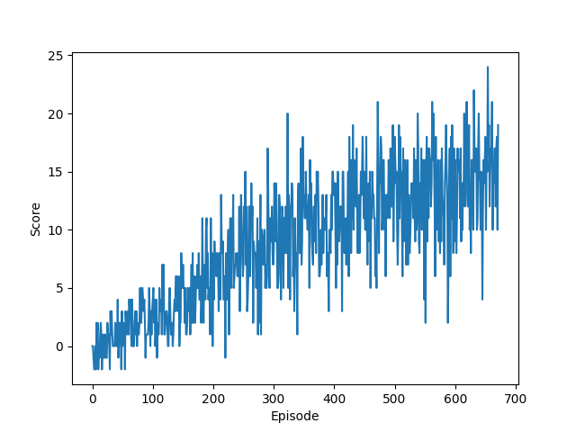

# Introduction:
this report is for the first project of Deep reinforcement learning nano-degree on Udacity.
This project is about training an agent to learn to collet YELLOW bananas in a Unity environment.
In this  report we will present :

1. Algorithm : the algorithm used to train our agent
2. Hyper parameters 
3. the results 
4. Future improvements

# I- Algorithm 

In this project we use Vanilla DQN algorithm that was created in 2015 and trained to play atari games.

Our agent will see one state at a time take an action and receive a reward.

The agent will receive +1 if it collects a yellow banana. -1 if it collects the blue banana 

The agent is a neural network composed by an input layer, hidden layer and an output layer. all the layers are followed by Relu activation function.

to train the agent we used a mean squared error loss function between Q values of the target network (expected output) and the Q values of the local network (our agent output).

# II- Hyper parameters 

    - BUFFER_SIZE : 100000 : replay buffer size

    - BATCH_SIZE : 64 : the size of the batch passed to the model

    - GAMMA : 0.99 : discount factor 

    - TAU : 0.001 : parameter used to update the weights of the target network

    - LR : 0.0005 : Learning rate

    - UPDATE_EVERY : 4 : after how much steps we update the target network weights 

    - device : "cpu" the device used to train the agent (cpu or gpu)
    
    n_episodes: 2000 : the maximum number of episodes 
    
    max_t: 1000 : maximum number of steps to do in a single episode while not finished yet.
    
    eps_start: 1.0: starting value of epsilon when starting the learning process 
    
    eps_end: 0.01: minimum value that epsilon can achieve while training
    
    eps_decay: 0.995 : decay factor for epsilon

# III- Results :
My agent solved the environment in 572 episodes 

    Episode 100     Average Score: 1.133
    Episode 200     Average Score: 3.92
    Episode 300     Average Score: 7.77
    Episode 400     Average Score: 10.22
    Episode 500     Average Score: 12.17
    Episode 600     Average Score: 12.85
    Episode 672     Average Score: 14.01
    Environment solved in 572 episodes!     Average Score: 14.01

Below you will find the plot of the score in each episode 

 

# IV- Future improvements :

In this project we used the vanilla DQN but there is plenty of amelioration that have been done to this algorithm like : Double DQN, Dueling QDN and rainbow.

Another thing that we can do to improve the learning of the model is tune the hyper parameters